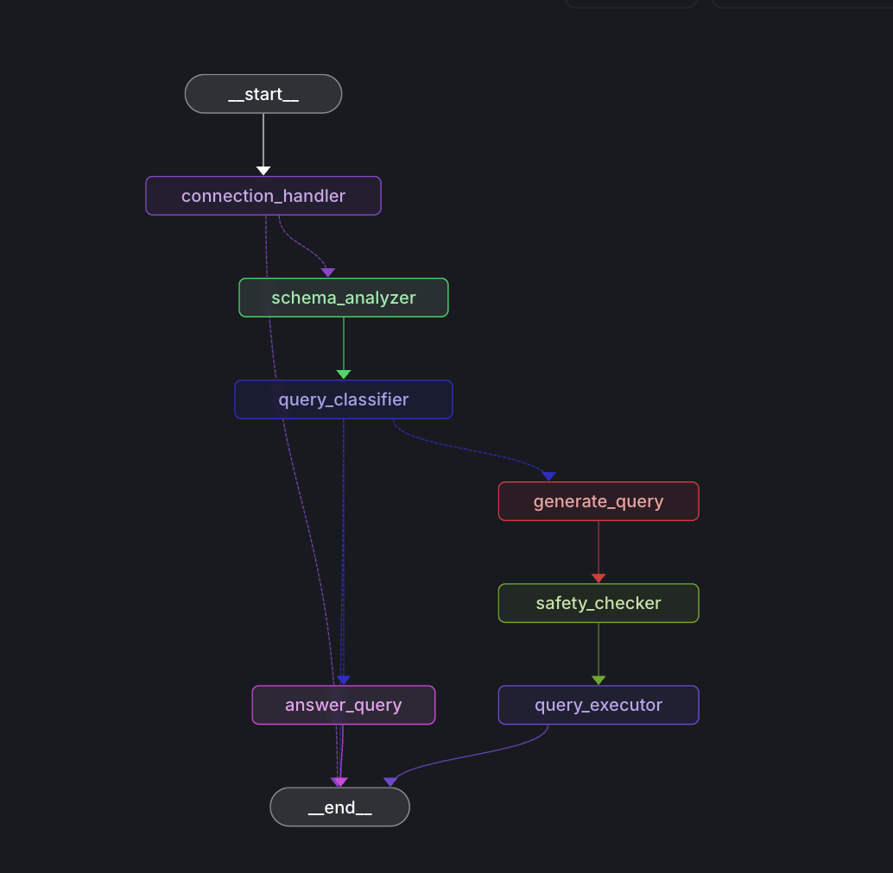

# OpenQuery

OpenQuery is an intelligent SQL chatbot that enables natural language interactions with your database. It allows users to explore database schemas, tables, and execute queries through a conversational interface. The system leverages a sophisticated LangGraph-based pipeline to process queries efficiently while ensuring both performance and safety.

## System Architecture



The system follows a structured pipeline powered by LangGraph with the following components:

1. **Connection Handler**: Manages database connections and initial request processing
2. **Schema Analyzer**: Analyzes and validates the database schema for context-aware responses
3. **Query Classifier**: Classifies natural language inputs to determine appropriate query types
4. **Generate Query**: Transforms natural language into optimized SQL queries
5. **Safety Checker**: Ensures query safety and prevents potential security issues
6. **Query Executor**: Executes the validated SQL queries against the database
7. **Answer Query**: Formats query results and provides natural language responses

## Technology Stack

### Backend
- **LangGraph**: Core query processing and orchestration
- **LangGraph CLI**: Service deployment and management
- **TypeScript**: Type-safe development

### Frontend
- **Next.js**: React framework for the web interface
- **Assistant UI**: Rich chat interface components
- **TypeScript**: Type-safe development

## Project Structure

```
├── apps/
│   ├── agents/     # LangGraph backend services
│   └── web/        # Next.js frontend application
```

## Features

- Natural language interactions with databases
- Schema and table exploration
- SQL query generation from natural language
- Query safety validation
- Rich chat interface for database interactions

## Development

To get started with development:

```bash
pnpm install
pnpm dev
```
